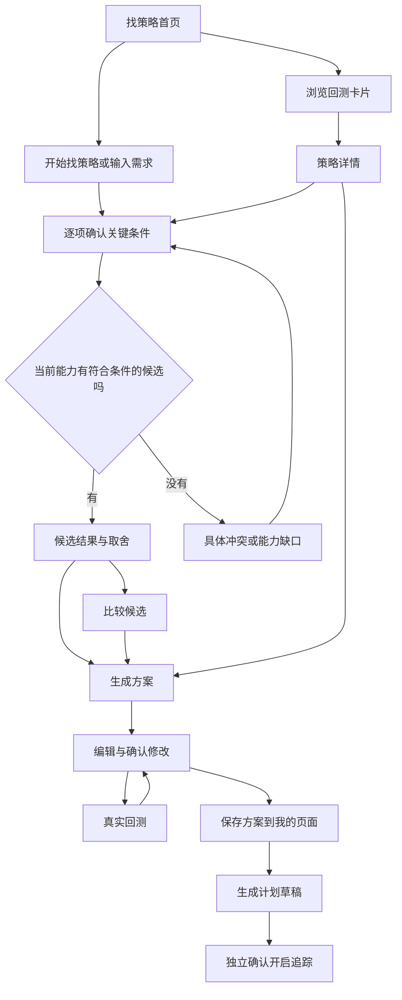

# SUVI「找策略」完整优化方案 v2.0

日期：2026-09-28
状态：设计方案；客户端已实施首屏启动、策略卡片、候选引用与方案草稿的第一批改造，完整验收仍未完成。
用途：产品评审、高保真设计、客户端开发与验收。
适用：Windows、macOS 共用客户端页面，以及后续移动端页面。
版本关系：本方案取代 v1.0 的首页布局、卡片密度、启动入口与候选交互设计。v1.0 的真实数据、权限与交易约束继续有效；发生冲突时以本方案为准。

## 1. 产品决策

模块目标：帮助普通投资者把自己的资金安排和偏好转成有证据的策略选择，再形成可以修改、回测、保存和追踪的方案。

本轮解决的问题：

| 当前问题 | 用户付出的成本 | 本轮决定 |
|---|---|---|
| 三个偏好短语和空输入框缺少明确动作 | 必须先想好如何提问 | 提供不输入也能点击的「开始找策略」，由系统先提出一个具体问题 |
| 卡片占据绝大多数首屏空间 | 第一感受是逛目录，AI 只是附加功能 | 启动区成为首屏主操作；卡片压缩为选择摘要 |
| 每张卡片接近一份报告 | 阅读负担高，主按钮落到首屏之外 | 保留两个主指标、短曲线、必要口径；其余进入详情 |
| 发起对话后仍要自己总结答案 | 聊了很多，却没有形成可操作结果 | 对话产生候选、对比、方案等业务对象 |
| 卡片收益易被直接横比 | 把不同现金流、标的或区间的结果误当统一排名 | 指标按资金模型命名；只有口径一致才进入共同图表 |

首页保留两条路径：不会选的人直接开始，由 AI 提问；想先看数据的人独立浏览回测。两条路径在同一个探索任务中汇合。

平台业务目标通过「完成一次有依据的策略选择、保存后再次使用、分享可复用方案」承接。聊天次数、卡片点击次数、交易频次不单独作为成功指标。

## 2. 全局约束

1. 页面用动作、对象和反馈表达用途。无营销副标题、能力自述、重复标题或流程口号。
2. 空闲时只有启动区与策略精选，不展示空白聊天侧栏。对话开始后使用主内容区。
3. 回测是选择证据。不能因压缩卡片删除费用缺失、数据日期、回测样本等关键事实。
4. 所有收益、净值、曲线和执行状态必须来自真实结果；本文的占位符不作为演示数据。
5. 模型可以提出候选和修改提议；业务对象须经过数据与规则校验后渲染。
6. 首页不恢复「我的计划、运行历史、定时任务」标签。保存后的方案和计划在「我的页面」管理。
7. 讨论、方案保存、开启追踪、实际交易是不同动作。当前客户端不提交申购、赎回、撤单或支付。
8. 用户已确认的信息复用；AI 推测单独待确认，不直接写入用户画像。
9. 文字输入、点击按钮、直接编辑都能推进核心流程，不强迫用户为按钮操作发一句话。

## 3. 页面结构与状态

| 状态 | 主内容区 | 主操作 | 返回时保留 |
|---|---|---|---|
| S0 首次进入 | 启动区＋策略精选 | 开始找策略 / 查看回测 | 输入草稿、筛选、收藏、滚动位置 |
| S0-R 再次进入 | 启动区＋一条最近探索＋策略精选 | 继续探索 / 开始新的探索 | 原任务独立保留 |
| S1 开始选择 | 一道具体问题＋可点击答案＋自由输入 | 回答当前问题 | 已答信息和原始消息 |
| S2 形成候选 | 简短结论＋最多三项候选＋对话 | 比较候选 / 生成方案 | 候选顺序、排除原因、引用 |
| S3 策略详情 | 规则、真实回测和按需展开的数据 | 按此策略生成方案 | 来源任务、图表区间、阅读位置 |
| S4 对比 | 对比表、可比性状态及取舍 | 选这个 / 按我的情况比较 | 对比对象及版本 |
| S5 我的方案 | 目标、资金、标的、参数、回测 | 按此配置回测 / 保存方案 | 草稿、旧结果、修改差异 |
| S6 已保存 | 保存结果与方案入口 | 查看方案 / 生成计划 | 方案版本和关联任务 |
| S7 计划承接 | 我的页面中的计划详情 | 确认开启追踪 / 查看事件 | 计划版本、执行记录和事件 |



## 4. S0 首页：启动操作明确，策略卡片轻量

### 4.1 1440 × 960 布局

客户端标题栏沿用现有样式，高度约 40px；左导航约 224px，只有一级分类。主区两侧内边距 28px，内容自然滚动。

| 区域 | 建议高度 | 内容 |
|---|---:|---|
| 页头 | 44px | 左侧「找策略」；不放搜索和收藏 |
| 启动区 | 180–210px | 一个具体问题、输入框、场景按钮、主操作 |
| 最近探索 | 无记录时 0；有记录时 32–40px | 最多一条，不占空白大区块 |
| 策略工具栏 | 44–48px | 「策略精选」、搜索、收藏、分类 |
| 策略卡片 | 目标 300–330px/张 | 两指标、短曲线、必要口径和操作 |

首屏必须出现完整启动区、第一排完整卡片及卡片操作。1366 × 768 下通过减少外部间距、降低图表高度实现；不缩小正文，也不强行把所有五张卡塞进一屏。

按实际主区可用宽度决定列数：≥1080px 三列，680–1079px 两列，<680px 一列。单卡宽度目标不低于 340px。业务信息较多时允许增高，不硬裁关键风险。

```text
┌─────────┬─────────────────────────────────────────────────────┐
│ 左导航  │ 找策略                                              │
│         │                                                     │
│ 找策略● │ 你准备怎么投资？                                    │
│         │ ┌─────────────────────────────────────────────────┐ │
│         │ │ 例如：每月能投 2,000 元，三年内不用，想少操作    │ │
│         │ └─────────────────────────────────────────────────┘ │
│         │ [每月有闲钱] [已有一笔钱] [想调整持仓] [开始找策略→]│
│         │ 继续：每月定投方案 · 待确认风险                  → │
│         │                                                     │
│         │ 策略精选                   搜索策略      ☆ 收藏    │
│         │ 全部  估值  趋势  波动  轮动                        │
│         │ [紧凑策略卡]       [紧凑策略卡]       [紧凑策略卡]  │
│         │ [紧凑策略卡]       [紧凑策略卡]                     │
└─────────┴─────────────────────────────────────────────────────┘
```

不增加「帮我选 / 我已有想法」两套模式切换：输入框本身已经承接已有想法。用户不应先决定采用哪种交互模式，才开始找策略。

### 4.2 启动区

这是一个与页面对齐的内容区，背景比页面略亮；不再用多层边框套住标题、场景、输入框。输入框是唯一明确描边的编辑区域。

- 问句：**你准备怎么投资？**，18–20px，中等字重。
- 输入框：默认 64–76px；示例仅作 placeholder，不自动填入真实预算。
- 相邻场景：**每月有闲钱 / 已有一笔钱 / 想调整持仓**。它们表示任务入口，不是推荐结论。
- 主按钮：**开始找策略**，最小 44px 高，香槟色或米白实底。
- 不显示模型名、推理等级、账户权限勾选、待机状态、流程步骤。模型设置留在全局设置；需要账户数据时再就地请求。

启动规则必须区分导航与发送：

| 操作 | 行为 |
|---|---|
| 空输入点击「开始找策略」 | 打开 S1 的第一道问题；不发送空消息，不创建空聊天记录 |
| 输入有效文字后点击「开始找策略」 | 创建探索并提交原文；已经说清的信息不再问 |
| 点击「每月有闲钱」 | 进入 S1，明确记录该选择；询问金额或资金使用时间 |
| 点击「已有一笔钱」 | 进入 S1，询问大概金额及近期是否需要动用 |
| 点击「想调整持仓」 | 提供「手动说明 / 读取我的持仓」；仅后者进入账户授权与取数 |
| 输入框已有内容时点击场景 | 保留原文，场景作为可见的任务标签，可移除；不得悄悄覆盖原文 |
| 回车 | 换行；输入法选词期间不启动任何发送 |
| Ctrl/Command＋回车 | 仅非空输入时提交；空输入不触发启动 |

第一道问题可以由产品预设直接显示，必须表现为「开始选择」引导，不能伪装成模型已分析完成。用户提交第一个真实答案后，创建持久探索及对话；在此前离开页面不产生「新会话」垃圾记录。

### 4.3 最近探索

有记录时只显示一条：「继续：每月定投方案 · 待确认风险 →」。标题来自实际任务，状态来自真实进度。

- 继续：恢复原探索、输入草稿、候选与方案。
- 启动区新提交：创建新探索，不隐式追加到任意旧会话。
- 当前有运行任务：显示「查看正在进行的探索」，不把它插入另一任务；并发能力不足时明确提示。
- 历史探索沿用客户端最近对话，不在本模块额外建立历史标签页。

## 5. 策略卡片：保留证据，减少报告式内容

### 5.1 默认结构

```text
策略名称                                    ☆
一句说明：什么条件下投入、何时调整

回测收益指标                         最大回撤
真实指标值                           真实指标值
──────────── 真实短曲线 ───────────────

样本：基金简称 / 基金池
实际日期区间 · 费用状态                  口径 ⓘ

[查看回测]  [适合我吗]                  ＋对比
```

卡片按以下尺寸分配：名称行 24px；说明最多两行、约 36–40px；指标约 48px；曲线 48–60px；样本与口径约 40–48px；操作行 36–40px；其余为间距与边距。无图标装饰占据独立一行，无大色块卡套卡，无整行「加入对比」按钮。

策略名称 16px，正文 13–14px，指标 22–24px，日期与数据标识 12px。收益与风险同级展示。所有操作在卡片内完整可见。

### 5.2 信息分层

| 首页必须显示 | 点「口径」展开 | 进入详情 |
|---|---|---|
| 名称、核心运作方式 | 指标定义、计算对象 | 全部投入、调整和退出规则 |
| 两个有业务含义的指标 | 完整基金名称、基准名称 | 完整图表、阶段表现、交易明细 |
| 实际曲线 | 数据来源、更新时间 | 参数、资金安排、现金处理 |
| 样本、实际起止日期 | 参数摘要、报告标识 | 全部适用条件与风险 |
| 费用未计入/未知等重要限制 | 正常费用明细 | 调整回测与生成方案 |
| 风险异常或数据失效标记 | 版本与历史报告 | 比较和计划承接 |

同一页统一的数据更新日期可放在策略工具栏；不同时各卡单独显示，不能统一标成最新。来源支持点击展开及移动端点击查看，不能只依赖悬停。

常规风险与代价进入详情及个性化取舍。若存在会显著改变当前判断的限制，卡片保留一条短标记，例如「样本不足一年」「费用未计入」。不能用统一高度截断该标记。

### 5.3 指标适配，不能为简洁改错口径

两个指标槽位不等于所有策略强行使用两个相同字段。

| 真实结果类型 | 第一指标 | 第二指标 | 图表与必要补充 |
|---|---|---|---|
| 有净值化策略曲线 | 回测累计收益率 | 基于该曲线的最大回撤 | 短曲线；真实有效基准可作为细虚线并标明名称 |
| 分批投入，有可靠现金流收益指标 | 现金流年化收益率，明确方法 | 有效净值化曲线最大回撤 | 累计投入与期末资产可用紧凑资金摘要补充；不拿资产余额当收益曲线 |
| 仅有投入、期末资产和现金盈亏 | 模拟盈亏 | 累计投入 | 图表展示资产与累计投入双线，明确图例；期末资产同一区域可见，回撤不可计算时直说 |
| 现金池策略 | 根据真实收益模型选择以上方式 | 同上 | 指标口径说明是否包含现金；不把不同现金处理结果直接比较 |

不默认突出「模拟赚了多少元」，因为投入金额不同会造成误判。未提供可信收益率时可以使用盈亏金额，但必须同显投入，且不称收益排行榜。

基准画出来就必须有简短图例；空间不足时首页只画策略线，基准在详情完整展示。缺少真实曲线时显示「曲线暂缺」，不能前端补线。费用未返回显示「费用未知」，不能写成已计入或固定零。

### 5.4 操作

- 「查看回测」：主区打开 S3，回测区为默认焦点。
- 点击策略名称：同一 S3，规则区为默认焦点，不另造第二套详情。
- 「适合我吗」：带入策略引用；已有探索时复用已确认条件，首次则只问最关键的缺失项。
- 「＋对比」：选中态显示「已选」；收藏、对比都不自动启动 AI。
- 默认卡片绑定固定配置及已完成报告，不按历史最高收益挑样本。

## 6. S1 提问：不会问也能完成

### 6.1 第一问与分支

空输入启动后显示：

> 你准备怎么投入？
>
> 每月有结余　已有一笔钱　想调整持仓　暂时没想好

这道问题替换首页内容，不出现在右侧小窗口。下方保留自由输入框；按钮是回答本题的答案，不是四个同时发出的任务。

| 用户选择 | 优先补充 | 禁止推断 |
|---|---|---|
| 每月有结余 | 可投入金额；何时可能用钱 | 默认一定坚持三年或每月都能投入 |
| 已有一笔钱 | 总预算；是否保留近期用款 | 默认全部立即投入 |
| 想调整持仓 | 主要困扰；手动说明或授权读取 | 未取数就断言持仓风险或收益 |
| 暂时没想好 | 想长期积累 / 少操作 / 先看懂风险 | 以此作为完整风险评估 |

### 6.2 提问策略

- 每轮最多一个主问题；高度相关时可以增加一个附问题。
- 金额使用金额输入及「暂时不确定」；期限用实际用款时间，允许具体日期或范围。
- 不按固定问卷顺序机械推进。用户一次提供金额、期限和操作偏好后，下一问直接处理风险或资金安排。
- 用户可以跳过；跳过字段保持「未确认」，不以默认值代填。
- 早期即可展示「待评估候选」，但不能在关键条件缺失时写成「适合你」。
- 风险意愿以易懂的损失情景辅助理解，可结合用户已给预算换算金额；金额情景不代表预计亏损或亏损上限，也不替代正式测评。
- 用户表示高收益且完全不能亏时，指出具体冲突，提供「优先本金安全 / 接受一定波动再比较 / 暂不选择」，不捏造满足条件的策略。

### 6.3 首次有价值的结果

目标是尽早产生可见进展，而不是一定聊满若干轮。条件不足时，进展可以是排除不符合资金期限的策略、指出现有策略能力缺口，或展示需进一步确认的两项候选。

普通路径参考：投入方式 → 金额和用款时间 → 风险与操作偏好 → 候选。顺序和轮数随已知信息调整。

## 7. S2 主页面对话与候选结果

```text
← 策略精选        每月投入方案                    ⋯
每月 2,000 元 ✎   三年内不用 ✎   希望少操作 ✎

用户：每月投 2,000 元，三年内不用，想少操作。

SUVI：投资过程中出现亏损，你大约能接受多大幅度？
[填写范围] [还不确定]

……条件足够后……
候选策略                                      比较候选
策略甲  真实回测摘要  符合：实际条件  需考虑：实际代价
[查看回测] [生成方案] [不考虑]
策略乙  真实回测摘要  符合：实际条件  需考虑：实际代价
[查看回测] [生成方案] [不考虑]

引用：策略甲 ×
┌────────────────────────────────────────────────────┐
│ 例如：把操作频率更低的放在前面                 发送 ↑│
└────────────────────────────────────────────────────┘
```

图中策略甲/乙为布局占位，实施时仅展示有实际依据的候选及数据。

### 7.1 消息与工作对象

- 对话正文阅读宽度 800–900px；候选、图表、对比可扩展至主区宽度。
- 回复采用短判断＋证据引用＋下一步动作。已显示在对象上的数据不再逐项抄进长段回答。
- 一次默认展示 2–3 项候选；只有一项时展示一项，没有时明确没有。
- 候选对象稳定存在，后续修改更新同一对象的版本。消息中保留更新说明，不无限复制相同卡片。
- 候选默认使用紧凑横向条目，不再把首页完整卡片搬进聊天。
- 展示「符合」与「需考虑」各一条，引用具体已确认条件和策略规则；没有依据不显示匹配率。
- 「不考虑」仅影响当前探索；允许可选填写原因及撤销，不写成永久偏好。

### 7.2 偏好与候选变化

已明确表达的条件成为可编辑标签；尚未提及的字段不排成一整行待填表。模型推断以「是否更在意……？」的问题确认后再入库。

直接编辑条件与自然语言修改走同一状态更新入口。比如用户改为「半年后用钱」，先显示变更字段，原候选标记「待重新评估」，重新分析完成后显示实际冲突。不能保留旧「符合」标签假装条件没变。

不支持的运行频率必须说清楚「现有策略不支持该执行节奏」，提供现有可选方式，不能把任意自然语言拼成可执行规则。

### 7.3 引用与返回

输入框上方最多直接显示三项引用，可逐项移除；更多折叠。查看对象和本次发送引用是两个明确状态：查看详情不自动发送；点击「问这段回测」才附上报告、区间与问题。

「前两个」绑定发送当时可见候选的稳定顺序；后台新结果返回不得改变该消息的指代。不明确时展示对象名称请求确认。

返回列表、详情、对比后保留原任务；任务栏提供「回到讨论」。不把 unrelated 的最近聊天自动接到找策略任务中。

### 7.4 运行体验

发送按钮在纯空格、输入法组合输入、已有请求待提交时不发送。开始分析后显示真实阶段，支持停止当前生成、保留已完成内容、失败重试。运行期间可编辑下一条草稿，首版不隐式排队。

用户在底部时跟随输出；向上阅读时停止自动滚动，出现「查看新回复」。回到列表仍能看到任务在运行，重新进入不用再发一次问题。

对话输入默认 64–80px，逐步增高至约 160px 后内部滚动。快捷问题紧邻输入框，有实际结果后最多两项，例如「比较操作频率」「看主要风险」，不每轮恢复三个通用场景。

## 8. S3 详情与 S4 对比

### 8.1 详情

顶部：返回来源、策略名称、收藏；主内容使用「回测 / 规则」两个内部切换，保留同一策略对象。

回测页：完整曲线 → 指标及资金摘要 → 回测设置 → 交易依据。规则页：投入条件 → 调整条件 → 退出条件 → 风险与适用限制。普通用户默认只看到核心配置，详细参数按需展开。

顶部保留一个明确主操作「生成我的方案」；图表旁提供「问这段表现」，规则旁提供「这条规则怎么执行」。这些按钮打开主区讨论，带入相同对象。

图表范围缩放与重新回测分开。缩放不改变全区间指标；区间问答必须携带报告 ID、选区和真实数据点。缺乏因果证据时区分事实与可能因素。

### 8.2 对比

选中至少两项后开启对比，最多三项。选满后第四项不替换已有对象。对比栏使用紧凑行，预留空间，不覆盖输入和卡片按钮。

对比顶部明确对象；顺序是用户相关取舍、执行规则、风险、历史指标与口径。每列提供「选这个」，生成相应方案草稿，不启动追踪或交易。

- 可比：日期、资金安排、收益定义、回撤对象、费用、现金处理经校验一致，允许共同图表。
- 不完全可比：逐项标注具体差异，例如「投入节奏不同」「费用口径不同」，历史数据分别展示。泛泛写一句“仅供参考”不够。
- 统一条件回测只在所选策略真实支持时可点；否则说明具体哪项条件不可统一。
- AI 结合已知偏好讲取舍，不以单次历史收益最高选出赢家。

手机默认一次对比两项，第三项通过对象切换进入同一视图；核心行尽量同屏，完整表格允许局部横向滚动，不让整个页面横向溢出。

## 9. S5 我的方案：选完之后能继续做事

### 9.1 进入方式与版式

候选、详情、对比均可生成方案，直接操作与对话指令使用同一创建入口。主内容区打开方案，左上返回讨论或来源对象，顶部标记「草稿 / 已保存 / 有新修改」。

首屏字段顺序：计划名称、目标与用款时间、预算及周期、标的、核心投入与退出规则。详细参数、证据与报告按需展开。对话输入位于方案下方或通过「问这个方案」切回主区讨论，不增加右侧小窗。

| 字段 | 值的来源与约束 |
|---|---|
| 名称、目标、期限 | 已确认信息或用户手填；未给出就留空待填写 |
| 预算及预算周期 | 分清单次投入、周期预算和总上限，不能互相代替 |
| 执行节奏 | 仅支持策略允许的日历或条件触发形式 |
| 基金或候选池 | 沿用已选标的；未选时明确未选，不能自动把展示样本当用户选择 |
| 投入、调整、退出规则 | 来自策略版本；只能编辑被支持的参数 |
| 提醒与运行位置 | 展示当前真实能力；本机追踪明确依赖客户端运行 |
| 关联回测 | 报告 ID、参数版本、标的、区间、费用及有效性 |

默认展示样本可以作为候选标的，但保存可执行计划前须用户明确选择。未知字段允许保存方案草稿，但不能静默补齐并开启追踪。

### 9.2 修改与差异确认

直接编辑保留草稿并提供撤销；AI 修改先生成字段差异，用户可「应用修改 / 放弃」。例如更改投入频率时，同时展示原预算、拟议分配方式、预计执行次数和总额变化。

「每月 2,000 元」改为「每两周一次」时，不直接改成每两周投入 2,000 元。按用户指定起止日期与实际执行日历计算次数；年度预算是否保持不变由用户确认。无法支持该周期时不生成虚假可执行方案。

影响回测的字段变动后，旧报告保留并标注「配置已修改」，不得继续把旧数据标成当前方案回测。仅名称改动不令报告失效。

### 9.3 回测与保存

「按此配置回测」提交当前明确参数，返回真实任务状态。失败保留草稿和原结果；不支持取消的任务只能返回方案，不能用停止动画假装后台已取消。

完成后展示新报告，绑定策略、标的、参数、时间和费用。AI 解释该报告，不用首页固定样本冒充用户条件结果。

「保存方案」保存完整或未完成草稿，成功反馈含「查看方案」。结果出现在「我的页面」；重复点击与请求重试不能创建多份。保存失败保留未保存标记及本地内容。

已保存方案的后续修改生成新版本，历史版本和报告可追溯，不覆盖原数据。

## 10. S6/S7 保存后与投后承接

保存方案之后可「生成计划」。先创建计划草稿，展示所选方案版本、标的、预算、触发/退出规则、检查频率和提醒能力，再通过独立「开启追踪」确认。

当前如果只有本机检查，显示「本机追踪 · 客户端运行时检查」；下次检查时间由真实调度状态提供，关闭客户端时不显示云端仍在监控。

计划详情包含状态、最近变化、实际检查记录、执行记录和事件。没有交易数据时只展示回测与用户记录，不制造实盘收益。「尚未记录执行」不能直接等同于未执行。

每个计划使用独立讨论上下文，引用版本和事件。用户资金用途变化时生成调整草稿，经确认后更新版本。恢复、暂停、结束均保留历史记录。

## 11. DIY、移动端与社区

### 11.1 DIY 边界

首版允许用户编辑已有策略支持的参数和方案页面模块。不支持的规则作为「待验证规则草稿」，与可执行方案明确区分。模型不得生成脚本后直接成为交易规则。

可选页面模块包括方案摘要、回测、规则、检查事件、执行记录；实际有数据才展示。调整模块顺序与隐藏设置只影响展示，不修改策略执行逻辑。

### 11.2 移动端

- 同一方案对象和页面配置响应式展示，不复制成另一份手机方案。
- 375/390px 下隐藏桌面侧栏，使用移动导航；输入、按钮最小触控区域约 44px。
- 首页启动区先出现，场景按钮换行，卡片单列；不为了容纳三项把字压小。
- 对话正文全宽，业务对象纵向排列；快捷问题支持横向滚动且有可见边缘提示。
- 表格局部滚动；主要操作可达。软键盘弹起时输入框跟随可视区域，预留安全区。
- 源码响应式与真实跨设备同步分别验收。手机不能通过桌面的 127.0.0.1 自动读取方案。

### 11.3 社区

分享入口放在已保存方案/页面详情，首页不加分享任务。发布前预览公开内容：公开策略规则、参数模板、回测口径、页面结构。

私人目标、预算、持仓、交易、聊天与凭据默认不进入公开模板。使用他人模板只复制允许字段，再建立自己的方案。回测变化不改写已发布的历史快照。

社区服务未接入时不显示发布成功；有真实导出能力可以提供「导出模板」。社区和跨端服务属于后续阶段，不用假接口补成演示成功。

## 12. 状态、数据与实现契约

| 对象 | 最小信息 | 持久化与恢复 |
|---|---|---|
| 探索 | ID、会话、确认条件、待确认提议、候选、排除原因、当前引用 | 首次有效回答后持久化；首页继续必须恢复相同任务 |
| 策略引用 | 策略 ID、版本、真实能力范围 | 版本变更不能偷偷替换旧方案 |
| 回测报告 | 报告 ID、参数、标的、区间、资金模型、费用、来源、指标定义、曲线 | 对话和页面引用同一个报告 |
| 对比 | ID、最多三个对象、稳定次序、比较口径、差异原因 | 从消息重开还是同一对比 |
| 方案 | ID、版本、草稿字段、待确认项、差异、关联报告、状态 | 服务端保存＋本地未保存恢复；需有并发版本校验 |
| 计划 | ID、方案版本、检查状态、事件、执行记录 | 与探索及方案分开，不因保存方案启动 |

推荐候选动作至少包含策略引用、使用了哪些已确认条件、证据引用、冲突/缺失项。界面不能解析模型散文中的数字来绘图或直接执行修改。

模型提出条件修改、候选、对比、方案差异；业务服务验证枚举、类型、策略支持范围和预算约束后写入。保存、启用追踪和发布只接受用户明确动作。

回测缓存应覆盖策略版本、参数、标的/池、区间、资金与费用口径、数据快照；数据更新时标记旧报告日期，不永久当成最新。生成/保存使用幂等标识，旧对象兼容迁移，不清空用户数据。

## 13. 异常与边界

| 情况 | 界面与动作 |
|---|---|
| 未配置模型 | 仍能查看真实策略和回测；点击启动后保留输入，提供「设置模型」；返回后恢复 |
| 模型失败 | 保留用户消息、候选与方案；显示失败原因和重试，不伪造回答 |
| 不知道预算或风险 | 保留未确认，允许了解策略；不直接生成适合性结论 |
| 没有符合策略 | 列具体冲突或目录缺口，提供可编辑条件；不偷偷放宽要求 |
| 回测缺失 | 保留名称和规则，显示缺失原因、重试；不填零，不补假曲线 |
| 回测口径不一致 | 单独列示差异，禁止排名；真实支持时允许统一条件回测 |
| 数据读取中 | 占位维持卡片布局，入口仍可用；迟到请求不得覆盖用户正在编辑的内容 |
| 更改条件后分析中 | 原结果保留但标注待重新评估，不能当作新条件推荐 |
| 保存失败或冲突 | 保留草稿，允许重试或另存，不能先显示成功 |
| 运行中切页或重启 | 从真实任务状态恢复；不可用时明确中断，不能永久显示处理中 |
| 进入另一张卡片 | 更新查看对象，展示本次引用；不自动发送也不悄悄带入其他方案 |
| 搜索/收藏无结果 | 简短空状态＋清除筛选/查看全部，不再插入宣传区 |

## 14. 视觉与微交互

采用现有黑色系客户端：页面背景参考 #0B0B0D，内容面 #151517，输入面 #1C1C1F，边框 #343437；主文字 #F0EEEA，次文字 #B8B5AE，香槟点缀 #D6C29A。实施前按实际字体与背景校验对比度，不靠降低字号压缩内容。

启动区主按钮是首屏最明确的实底动作。策略卡片按钮使用轻描边或文字样式，不让五张卡同时出现五个同等强度的大金色按钮。收藏是图标，提供可访问名称及选中反馈。

图表与指标承担视觉重点；装饰图标不单独占一行。卡片悬停仅改变边框或背景，不抬升位移导致鼠标目标变化。问答选项选中有明确状态，提交期间防止重复提交。

状态切换可以有 120–180ms 轻量过渡；减少动画设置下直接切换。键盘焦点可见，弹出说明关闭后回到触发控件。保存与失败信息使用可访问状态提示，不只改变颜色。

## 15. 业务指标与可用性验证

本轮核心观察：有效探索完成率，即用户从进入模块到形成明确候选或得到具体不匹配原因的比例；与后续方案保存、再次使用一起判断。

| 环节 | 观察内容 | 防止误读 |
|---|---|---|
| 首屏理解 | 首次使用者能否找到开始入口；是否需要别人教如何提问 | 停留时间长可能是看不懂 |
| 探索启动 | 空白启动、场景启动、自由输入各路径完成首答的比例 | 不把点一下启动算完成任务 |
| 条件形成 | 重复询问率、无意义轮次、用户修改误解的次数 | 不以聊天越多越好 |
| 候选结果 | 候选查看、证据阅读、对比、明确拒绝 | 无匹配但解释正确也有价值 |
| 方案 | 有效回测、保存成功、再次打开继续编辑 | 不把未保存草稿算完成方案 |
| 持续使用 | 保存后 7 日恢复、计划检查事件使用 | 不通过频繁行情通知制造留存 |
| 质量 | 用户是否理解回测非收益承诺、预算变化与追踪位置 | 交易量增长不能抵消误解和投诉 |

先用 5–8 位目标用户进行定性试用，分别覆盖“不知道怎么问”“先看回测”“已有明确条件”。该数量用于发现交互问题，不据此断言统计显著提升。

观察任务：不解释页面，请用户找到一种适合自身目标的候选、看懂一项风险、改一次预算并保存。记录首次犹豫点、误点、重复回看与求助；据此调整，而非仅问“好不好看”。

## 16. 实施顺序与交付边界

### P0：必须完成一条真实主流程

1. 首页启动区、无输入启动、相邻场景与紧凑卡片；清理旧解释性区块及重复 CSS。
2. 主区问答、确认条件、独立探索恢复；明确模型失败与数据失败。
3. 实际候选对象、可追溯回测、详情与最多三项对比。
4. 方案字段编辑、AI 修改差异确认、真实参数回测、保存与重新打开。
5. 保存结果接入我的页面；计划承接复用现有真实能力并准确显示运行位置。
6. 桌面与移动布局验收，覆盖主要异常状态。

P0 的交付不是只把输入框加高、卡片变矮。要完整跑通：开始 → 回答条件 → 形成候选 → 查看证据 → 编辑方案 → 真实回测 → 保存并恢复。

### P1 / P2

P1：独立计划讨论、版本调整、真实事件与提醒、账号级多端同步。P2：经过校验的规则组合、DIY 页面深化和社区模板发布。未具备的数据源和服务明确缺失，不模拟成功。

## 17. 验收与交付物

| 编号 | 场景 | 通过标准 |
|---|---|---|
| 01 | 首次进入、不会提问 | 不输入即可找到并点击开始，看到一道可回答的问题 |
| 02 | 空输入或输入法选词 | 不产生空用户消息和空最近对话 |
| 03 | 一次输入金额、期限、少操作 | 不重复问已知条件，下一问针对真正缺失项 |
| 04 | 不确定或暂时跳过 | 保留未确认，不擅自默认金额/风险 |
| 05 | 1440 × 960、1366 × 768 | 启动区与第一排卡片操作完整可见；无大量空白或挤压文字 |
| 06 | 策略卡片 | 不是缩小字号后的完整报告；指标与真实资金模型一致 |
| 07 | 点收藏、对比、图表 | 不意外发起 AI；反馈、引用和导航正确 |
| 08 | 生成候选 | 真实存在、有证据、有主要冲突，最多三项，无虚构匹配度 |
| 09 | 条件变化 | 旧候选标记待评估，更新后说明实际变化 |
| 10 | 对比第四项/不同口径 | 不替换已有项；具体标差异，不做收益赢家排序 |
| 11 | 详情选区问原因 | 绑定真实报告和区间，事实与推测分开 |
| 12 | 每月改每两周 | 差异、预算和真实日历计算可见，确认前不应用 |
| 13 | 修改参数回测失败 | 草稿和旧报告保留；旧结果不冒充当前配置 |
| 14 | 保存/重试/重启 | 无重复方案，保存状态准确，方案与探索可恢复 |
| 15 | 返回列表、详情、对比 | 选择、输入及来源位置保留，不串到其他任务 |
| 16 | 开启追踪 | 单独确认，展示真实运行位置；无自动交易 |
| 17 | 375/390px、键盘弹起、200%缩放 | 输入和操作可达，无整页横向溢出或按钮竖排 |
| 18 | Windows/macOS | 共用资源一致；组合输入、快捷键和窗口区域正常 |
| 19 | 无模型、无数据、无合适候选 | 每种状态都有真实原因和可执行下一步 |
| 20 | 无同步和社区服务 | 无假同步、假发布、假监控状态 |

开发交付应包含：首页、第一问、候选结果、详情、对比、方案差异、保存后恢复、手机方案页及失败状态的真实截图；附通过/未通过的验收记录、数据口径和未接入能力。

最终评审先看用户能否完成选择，再评估视觉细节。首页文案只保留对象名称、问题、动作与必要的数据事实，本文的流程解释不得原样搬到界面上。

## 18. 当前客户端实施记录

更新时间：2026-09-28。此记录只描述已落实的代码，不代表完整 P0 已通过验收。

| 已落地 | 当前行为 |
|---|---|
| 首屏入口 | 显示「你准备怎么投资」、三种投入场景和「开始找策略」；空输入打开第一问，不创建空对话。首问在主内容区，回答后进入主对话。 |
| 首问场景 | 每月有结余、已有一笔钱、调整持仓分别询问不同条件；用户已选场景作为可见答案和 Agent 上下文。 |
| 策略卡片 | 去除规则段落与重复指标，保留经校验的策略累计收益、最大回撤、短曲线、样本/区间、来源/日期/费用状态和查看、解读、对比操作。 |
| 候选引用 | Agent 可用策略 ID 生成最多三项目录内候选操作卡；卡片默认回测注明是目录样本，不是个性化回测。 |
| 保存方案 | 回测核验通过后填写方案名、目标和资金使用时间，保存为本机草稿；保存不等于开启跟踪或交易。 |
| 方案回看 | 保存的目标与资金使用时间可在「我的页面」计划区看到；既有计划兼容旧字段。 |

| 尚未完成 | 后续工作 |
|---|---|
| 个性化结果的结构化持久对象、证据排除理由与偏好标签编辑；目前候选卡由对话引用 ID 渲染，候选依据仍由 Agent 在回复中说明。 |
| 方案自然语言修改的字段差异预览、撤销和版本更新。 |
| 保存后的完整恢复/跨会话回看及真实计划事件联动。 |
| Windows/macOS 与移动尺寸的实机视觉验收、首问到保存的端到端人工验收记录。 |

因此，目前的实现可以展示首屏、启动选择、策略证据与方案保存路径；不能据此宣称方案中的全部 P0 能力已经完成。
