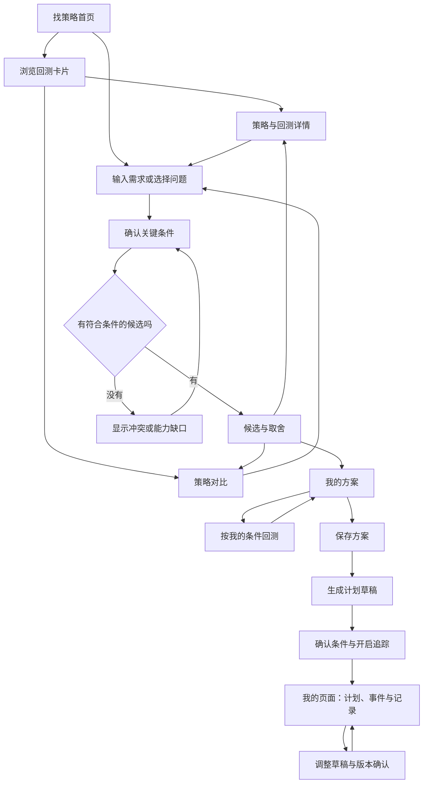

# SUVI「找策略」页面与全流程设计 v1.0

> 后续设计以 [完整优化方案 v2.0](./SUVI-找策略-完整优化方案-v2.0.md) 为准。v2.0 更新了首页启动、紧凑卡片、渐进提问、候选结果与全流程验收；本文保留为上一版设计及实现记录。

日期：2026-09-28
状态：设计基线；找策略首页、策略详情、策略对比、策略讨论入口、收藏搜索与真实回测展示已落地。计划草稿协同编辑、版本化调整及移动端真机同步仍需后续迭代。本文供产品、设计、前后端及执行 AI 使用。
项目：同花顺场外基金 AI 客户端 SUVI。
本方案约束页面与全流程实现；阶段性实现状态见本文顶部。

## 1. 目标与已确定的决策

模块目标：用 AI 帮普通投资者找到符合个人偏好的投资策略，让用户能够理解证据、比较取舍、形成方案，并继续保存、验证和追踪。

平台长期目标：扩大有效使用、口碑和影响力。该目标依靠发现、决策、投后和分享链路共同实现，不以多聊天或追求高回测收益作为成功标准。

必须落实的产品决策：

1. 回测是策略卡片的核心。首页展示真实曲线、关键收益和风险数据、口径。
2. 首页同时允许浏览策略和表达需求。输入入口前置且紧凑，不占掉数据主体。
3. 发起 AI 对话后使用主内容区。没有对话时不展示空白聊天面板，不使用右侧常驻小聊天窗。
4. 图表、对比和方案是可操作对象，出现在讨论中，也能独立打开。
5. 找策略首页不恢复“我的计划、运行历史、定时任务”标签；后续结果进入现有“我的页面”。
6. 延续黑色、深灰、米白的客户端视觉，香槟色少量点缀。桌面共用组件适配 Windows/macOS。
7. 页面内容支持移动端重排；响应式预览与真实跨设备同步分别实现。
8. 所有真实数据由已有服务或正式接入的数据源提供。缺失就显示缺失状态，不制作示例收益、假曲线或模拟实时数据。

### 1.1 文案原则：所有页面和后续产出适用

用对象、数据、按钮、状态和反馈说明用途。只保留帮助选择、操作、理解事实及必要约束的文字。

删除以下及同类文案：
- “先看运行方式，再按你的情况筛选”。
- “偏好会在讨论中逐步确认”。
- “从已接入的策略开始，或告诉 SUVI 你的目标和顾虑”。
- “策略能力库”“接下来你可以”“AI 将为你……”等无实际信息的区块自述。

页面名称“找策略”、按钮“查看回测”、输入示例、必要的风险和数据口径可以保留。技术版本、内部数据服务名不作为首页卖点，详情中保留可追溯信息。

本文的流程说明属于交付文档，不得原样搬进用户界面。

## 2. 用户与主要任务

| 用户场景 | 起点 | 应得到的结果 |
|---|---|---|
| 有目标但不会选策略 | 输入预算、期限或担忧 | 有依据的候选策略及不匹配点 |
| 想先看表现 | 浏览回测卡片 | 看懂收益、风险和主要规则 |
| 已看中某策略 | 查看回测、问是否适合 | 结合自身条件的判断及后续方案 |
| 在几个策略之间犹豫 | 加入对比 | 同口径数据和明确取舍 |
| 想调整现有策略 | 方案编辑、对话修改 | 受支持的参数方案及新回测 |
| 已保存方案 | 恢复探索、打开我的页面 | 接着补全方案、生成计划或查看监控 |

主流程：



浏览、详情、对比不要求先聊天。不满足条件时允许结束或保存探索，不强行推荐。

## 3. 信息架构与页面归属

客户端保留现有左侧一级导航。找策略包含以下内部视图：

| ID | 视图 | 返回位置 | 是否创建会话 |
|---|---|---|---|
| S0 | 策略列表 | 导航入口 | 否 |
| S1 | 策略详情/回测 | 原列表或原消息 | 否 |
| S2 | 对比 | 原列表或原消息 | 否 |
| S3 | 探索对话 | 原列表、详情或对比 | 首次发送有效消息时创建 |
| S4 | 方案草稿/修改差异 | 对应会话 | 可以直接编辑，无须发送消息 |
| S5 | 用户条件回测 | 原方案或策略详情 | 否 |
| S6 | 保存结果 | 对应方案 | 否 |
| S7 | 计划追踪 | 我的页面 | 计划讨论独立于探索会话 |

收藏是列表筛选入口，不占一级导航。探索记录沿用最近对话，自动给出简短任务标题，可重命名。

所有来源进入同一个对象视图：聊天里打开的回测与点击列表打开的回测使用相同组件和 runId，避免生成两套数据页面。

## 4. S0 首页：回测卡片与紧凑输入入口

### 4.1 布局

基准窗口 1440 × 960：客户端标题栏约 40px；左侧导航约 224px；主内容左右留白 24–32px。

主区从上到下：
1. 44px 工具栏：找策略、搜索、收藏。
2. 约 72–88px 输入框及相邻快捷问题，总区域控制在约 120px 内。
3. 40px 策略分类和排序工具栏。
4. 回测卡片网格。
5. 有最近探索时显示一条紧凑继续入口；无历史则不占位。

1440 宽默认两列卡片；宽屏达到 1600 且每卡可保留至少 360px 可用宽度时三列。不得为了展示三列缩小正文。首屏应看到输入框及第一排完整卡片，不做巨大空白和欢迎区。

```text
┌────────────┬────────────────────────────────────────────────────┐
│ 客户端导航  │ 找策略                              搜索   ☆ 收藏 │
│            │ ┌────────────────────────────────────────────────┐ │
│ 对话工作台  │ │ 每月投入 2,000 元，想少操作……                ↑ │ │
│            │ └────────────────────────────────────────────────┘ │
│ 看行情     │ 每月定投怎么选？  哪些策略操作少？  帮我比较策略     │
│ 找基金     │ 全部  定投  估值  趋势  轮动        排序：默认 ▾   │
│ 找策略 ●   │ ┌────────────────────┐ ┌────────────────────┐     │
│ 配资产     │ │ 策略名          ☆  │ │ 策略名          ☆  │     │
│ 看持仓     │ │ 简短运行规则       │ │ 简短运行规则       │     │
│ 我的页面   │ │ 收益/回撤关键数据   │ │ 收益/回撤关键数据   │     │
│            │ │     真实回测曲线    │ │     真实回测曲线    │     │
│            │ │ 区间 · 标的 · 口径  │ │ 区间 · 标的 · 口径  │     │
│            │ │ 查看回测 适合我吗 +│ │ 查看回测 适合我吗 +│     │
│            │ └────────────────────┘ └────────────────────┘     │
│            │ 继续：每月定投方案                          继续 → │
└────────────┴────────────────────────────────────────────────────┘
```

图中的类别根据实际策略目录生成；没有对应策略的类别不显示。数字只是输入示例，不预填真实字段或视为用户偏好。

### 4.2 首页交互

- 输入框占主内容宽度，与卡片左边界对齐，不套外层“大聊天卡片”。
- 快捷问题点击后直接提交其可见文字并进入 S3；后台只附加明确对象和任务上下文，不偷偷扩写用户预算、风险条件。
- 搜索只查策略名称、类别、公开规则，保留分类条件。无结果显示“没有找到相关策略”和“清除筛选”。
- 默认次序取可解释的运营配置；回测可用性等依据需记录，不能调用“收益最高样本”做默认展示。
- P0 排序提供“默认、已收藏”；收益排序只有在后续数据服务证明口径一致后才开放。
- 不在首页用数值阈值假装完成适当性筛选。
- 首次访问列出实际目录，不固定只展示收益最好的三个。五个策略可以自然滚动查看，不用大面积“查看全部”按钮撑版面。
- 输入区域在浏览时随页面自然滚动；向下浏览较远时可出现单行“问 SUVI”恢复入口，点击回到输入，不再复制第二套输入框。

## 5. 回测卡片：数据是中心

### 5.1 单卡结构

卡片高度目标约 380–430px，根据真实文本与指标模式自适应，不靠截断隐藏风险。使用统一结构：

1. 策略名、类型、收藏图标。
2. 一行运行规则，最长两行。
3. 三个重点数据位，收益与风险字号和权重接近。
4. 约 100–120px 曲线，策略与有效基准用颜色及线型区分。
5. 回测起止日期、标的或基金池、默认配置标识；数据口径可展开。
6. 简短执行特征和最主要风险各一行。
7. “查看回测”为主操作，“适合我吗”为次操作，“加入对比”为紧凑文字或图标操作。

点击名称打开规则详情；点击图表或“查看回测”打开 S1 回测页。收藏不触发导航；图表悬停不触发 AI。

禁止展示前端拼接的收益数字、仅根据起止点生成的假曲线、平滑过度的图形，或用 0 替代缺失值。

### 5.2 指标呈现规则

不能把所有资金模型强行套成同一组收益率。展示适配器由后端指标元数据驱动，不按名称猜测字段。

| 回测模型 | 卡片三个重点位 | 图表 | 必须附带的信息 |
|---|---|---|---|
| 一次性投入/净值化组合 | 累计收益率、年化收益率、最大回撤 | 可核验的净值收益曲线 | 初始资金、费用、现金、再平衡口径 |
| 定投/分批投入 | 累计盈亏金额、现金流年化收益率（可用时）、最大回撤（明确基于何曲线） | 优先展示真实净值化表现；不可得时展示资产与累计投入双线 | 累计投入和期末资产必须同时可见 |
| 带现金池/退出后等待 | 依据真实现金流模型选择上述模式 | 账户权益含现金的适用曲线 | 未投资现金、赎回现金及现金收益是否计入 |

资金加减导致的资产变化不是策略收益；含投入的资产曲线不能标为收益曲线。最大回撤需给出计算对象，不从含外部入金的资产余额直接计算并误称策略风险。

现金流年化需有效现金流、明确方法和可解结果；不可得时显示“暂不可计算”，可将该数据位替换为期末资产，不能套普通累计收益年化公式。所有字段显示实际中文名称，不把不同定义统一缩写成“收益”。

日期不足或公式不适用时不强行展示年化。指标缺失不影响已有真实数据展示。

### 5.3 卡片结果来源

- 每张卡绑定一个固定的展示配置和一个已完成 runId。
- 配置包含策略版本、参数、标的/基金池、时间区间、资金安排和费用。
- 不从候选基金中选择回测最高者作为默认卡片结果。已有函数名或返回“best”不能作为结果选择依据。
- 若只能展示某个基金的回测，直接显示该基金名称，不暗示代表整个策略的普遍表现。
- 策略版本更新后，旧结果保留旧版本标记，不能贴到新规则上。
- 优先读取缓存结果并显示截至时间；进入首页不重复发起全部策略重算。
- 更新中的卡片保留旧结果与旧时间。失败可重试，不把整页变空白。
- 无回测：数据区显示“暂无回测”，主按钮“设置回测”；规则和“适合我吗”仍可用。
- 缺曲线但有指标：显示已核验指标，曲线区显示“曲线暂不可用”，不得自行绘制。
- 基准不适用或缺失时不绘制基准线，不以零曲线替代。

## 6. S1 策略与回测详情

中间主区展示完整详情，顶部“返回”保留来源页面滚动位置。沿用紧凑标题，不另加营销标题。

```text
← 返回    策略名称                             ☆ 收藏  ＋ 对比
回测表现   策略规则

收益指标   风险指标   投入与资产
回测起止日期 · 标的 · 默认配置                  调整回测
┌────────────────────────────────────────────────────────┐
│ 真实曲线  [收益/资产] [回撤]       区间：近一年/全部      │
│                    可选择时间区间                      │
└────────────────────────────────────────────────────────┘
阶段表现       执行记录       回测口径

[生成我的方案]                            [解读这次回测]
┌────────────────────────────────────────────────────────┐
│ 问这条策略……                                         ↑ │
└────────────────────────────────────────────────────────┘
```

- 策略规则按投入、调整、退出顺序呈现，指标定义按需展开。
- 回测页显示固定结果来源、基准、费用、标的、规则版本、现金处理、数据截至时间。
- “近一年”若只缩放原曲线，必须标为“图表范围”；指标沿用完整回测并标明日期。需要一年期重新初始化的回测由“调整回测”另起任务，不能混淆。
- 图表选中区间后出现“问这段表现”，仅点击该按钮才发起 AI。
- AI 获得 runId、时间区间和已核验数据点，回答区分数据事实和可能原因。
- “调整回测”可编辑支持的参数、标的和时间；完成后创建新运行记录，原记录不覆盖。
- “生成我的方案”创建草稿，已确认条件填入，缺失信息用字段“待填写”，不强制先完成聊天。

## 7. S2 对比

加入对比后出现轻量底栏：“已选 2 项 · 对比”，可移除单项。最多三项，第四项提示“最多对比 3 项”，不自动替换。

进入对比后主区域显示完整表格与共同图表；首次至少两项才启用对比。对比栏不遮挡输入和主要按钮。

对比项：投入规则、执行节奏、资金安排、退出规则、主要风险、适用场景、回测指标、用户条件匹配情况。

对比采用两个清楚状态：
- 数据可比：显示统一日期、资金与费用设定，展示共同图表及指标。
- 数据不完全可比：规则仍可比较；历史结果单独列出具体口径差异，取消高低排序和赢家高亮。提供“统一条件回测”，但只在策略均支持该条件时可用。

相同时间不等于全部可比。需检查现金流、标的/资产范围、收益与回撤定义、费用、现金口径。不同风格策略的资产范围可以不同，但必须明确，并且结论不得归因于规则优劣而忽略资产差异。

“按我的情况比较”进入 S3 并引用同一个 comparisonId。用户说“前两个”时只根据当前稳定可见顺序解析；含糊或对象变化时确认名称。

表头提供“选这个”，创建对应策略方案草稿，仍可返回对比，不自动启动计划或买入。

## 8. S3 主页面对话与候选结果

### 8.1 对话布局

```text
← 策略列表    每月定投方案                               ⋯
每月 2,000 元 ✎   三年后用钱 ✎   每月处理 ✎

                         我每月投 2,000 元，想少操作

SUVI  如果出现阶段性亏损，你更倾向于怎么处理？
      [继续按计划] [减少投入] [暂时说不清]

……根据实际条件形成结果后……
策略甲       回测摘要与引用       符合条件/主要冲突
[查看回测] [对比] [生成方案]
策略乙       回测摘要与引用       符合条件/主要冲突

引用：策略甲 ×   回测记录 ×
┌────────────────────────────────────────────────────────┐
│ 继续提问……                                           ↑ │
└────────────────────────────────────────────────────────┘
```

对话正文阅读宽度约 800–920px；图表和对比可扩展到主区宽度，不能把宽表挤成窄聊天气泡。

### 8.2 上下文与提问

- 第一次发送有效问题才创建探索；返回列表不清空探索。
- 每轮只问最影响选择的一至两个问题，已确认信息不重复问。
- 用户明确说出的条件可以进入当前探索；推断只生成待确认提议，不直接写入条件或永久画像。
- 持仓、账户事实仅在已有授权和实际取数后引用，并标记时间；未连接账户仍可探索。
- 信息不足时只称“候选策略”，不称已适合用户。
- 不把历史最大回撤当未来亏损上限，也不以单个偏好答案代替正式风险测评。
- 自然语言和直接修改条件走同一个更新入口；更新后说明具体影响，例如“已改为每月投入；两项候选需要重新评估”。不加通用流程说明。
- 点击另一策略查看详情只改变“当前查看”；发送时引用对象在输入框上可见。自动带入当前对象时立即显示可移除标签，不静默混用旧对象。
- 多对象引用最多保留可理解的紧凑标签，超出时折叠为“另 2 项”，可展开移除。
- 缺关键条件时先问；无匹配时指出具体冲突，允许修改或保存探索，不擅自放宽约束。
- 用户要求确定不亏且高收益时先处理目标冲突，不生成满足承诺。

### 8.3 回复与对象

回复采用短判断、可核验依据、下一步操作。例：根据执行节奏筛出两项后，给出执行规则引用，不复述整套首页资料。

推荐结果、回测报告、对比表、方案均通过结构化引用渲染。模型不直接编造收益图表 HTML 或执行任意脚本。已有对象可点击、编辑、保存、重新打开。

候选排除可记录原因，支持撤销。单次排除只影响当前探索，不自动形成全局偏好。

### 8.4 发送、等待、停止和失败

- 输入框默认 64–80px，多行逐步增高，上限约 160px；超过后内部滚动。
- Enter 换行；Ctrl/Command + Enter 发送；中文输入法组合输入期间不得发送。
- 纯空格禁发，不创建空会话。发送按钮使用单行布局，最小 40px 点击区。
- 快捷问题紧邻当前输入框，随讨论对象更新；有足够内容后减少为两项或不显示。
- 发送后显示用户消息与真实运行状态。阶段必须来自真实事件，不显示伪造百分比。
- 运行中可以编辑下一条草稿；P0 不排队发送，当前运行结束后发送。停止按钮仍可访问。
- 停止不删除已完成内容；重试生成新的 attemptId，避免重复保存对象。
- 模型失败与回测服务失败分别反馈。原报告、草稿和用户输入保留。
- 用户停留在底部时跟随新内容；向上阅读后停止自动滚动，显示“查看新回复”。
- 回到后台、切换模块或重启时读取持久化运行状态；不能只用前端残留 running 布尔值永久禁用发送。

## 9. S4/S5 方案编辑与按用户条件回测

### 9.1 方案对象

字段：名称、关联策略及版本、用户目标、预算及预算周期、投入节奏、计划期限、标的或候选池、触发条件、退出条件、提醒设置、待确认项、关联回测记录。

规则分为可编辑参数与不可编辑约束。用户只能修改当前策略真实支持的部分。需要新增规则时生成“待验证规则草稿”，不得直接标为可执行策略。

方案草稿出现在对话中，可“展开编辑”。展开仍使用主区，不弹出狭小聊天窗。首屏先显示预算、节奏、标的和核心规则；详细参数可展开。

### 9.2 修改确认

直接编辑和 AI 修改都先形成草稿。AI 必须给出字段差异，并支持应用或放弃。示意：

| 字段 | 修改前 | 修改后 |
|---|---|---|
| 投入节奏 | 每月 | 每两周 |
| 预算 | 每月 2,000 元 | 年度预算保持 24,000 元，具体分配待确认 |

不能把每月 2,000 元直接变成每两周 2,000 元。每两周与每月两次不同，按实际执行日历计算次数和金额分配。对条件触发投入设置单次、周期或总预算上限，不声称必定全部投入。

应用前显示对预算、触发次数、标的和已有回测有效性的影响。未保存草稿可撤销；已保存版本通过新版本修改，不覆盖历史。

### 9.3 回测流程

1. 用户点击“按我的条件回测”。展示当前参数、标的、区间和资金安排。
2. 校验策略支持范围和数据条件；缺失项聚焦到字段，不启动无效任务。
3. 创建真实 jobId，展示排队、读取数据、运行、完成等实际阶段；可离开页面后返回。
4. 支持取消时真正取消任务；不支持时按钮只能“返回方案”，不能伪称已取消。
5. 完成产生新 runId，绑定参数哈希和策略版本。AI 解释该结果，不能引用默认卡片结果冒充个性化回测。
6. 修改影响结果的任何字段后，旧报告标为“参数已修改”，允许查看旧结果并重新回测。
7. 失败保留参数和旧结果；部分数据结果标明缺失范围，不称完成全面验证。

## 10. S6 保存与 S7 后续计划

### 10.1 保存方案

“保存方案”允许保存未完成方案，状态为草稿，列出待确认项。结果进入“我的页面”；探索中保留对象链接。

成功反馈：“方案已保存”及“查看方案”。不因保存自动开启监控。

“生成计划”从某个已保存方案版本创建计划草稿；存在关键参数或必要回测缺失时，先补充，不能用空对象开启追踪。

### 10.2 开启追踪

确认内容：策略和方案版本、标的、预算、触发和退出条件、检查频率、提醒方式、监控运行位置。按钮“开启追踪”。

如果服务只是本机运行，明确显示“本机追踪 · 客户端运行时检查”；关闭电脑后不得表现为仍在云端监控。缺少真实调度或通知能力时，保存为草稿并显示具体待接入状态。

开启成功后显示实际状态及下次检查时间。支持暂停、恢复、结束，重复操作幂等。

### 10.3 计划详情与事件

计划详情属于“我的页面”，保持找策略首页纯粹。包含当前状态、已记录投入、最近检查、下次检查、事件时间线和方案版本。

数据明确区分历史回测、用户手工记录、已同步交易。没有真实交易数据不显示虚构实盘收益。

事件示例：“本期投入日期已到，尚未记录执行”。操作：“记录执行”“查看条件”“稍后提醒”。尚未记录不能判为未执行。相同计划同一周期同一原因的提醒去重。

点“问 SUVI”进入该计划的独立讨论，带上计划版本和事件，不复用探索中的旧上下文。修改生成调整草稿，显示差异与影响，确认后产生新版本，保留历史记录。

### 10.4 交易承接

本项目当前约束不执行申购、赎回、撤单、支付。若已有官方跳转能力，可引导用户在同花顺 App 独立确认交易，再同步核对记录。没有真实跳转能力时不能做假“去交易”按钮。

后续平台若正式提供交易能力，需要另行设计订单确认、状态回传与去重流程。此次找策略实施不接入自动下单。

## 11. DIY、移动端与社区承接

### 11.1 DIY 范围

第一步支持策略允许的参数调整及方案页面模块配置；后续再支持经过校验的规则组合。AI 修改页面只提出模块差异，用户确认后保存。

页面模块建议：方案摘要、回测表现、计划状态、执行记录、事件列表。可以调整顺序、显示字段和模块显隐；不能随意隐藏数据口径或风险关键事实后作为公开收益展示。

### 11.2 移动端

- PC 1440/1280、移动 390/375 均可操作，200% 缩放不丢主要动作。
- 小于 768px 使用单列；侧栏收为导航入口；图表保持可读宽度，数据文字不缩成桌面版。
- 移动对比默认按维度纵向展示，最多三项，通过切换选中对象或展开查看，页面本身无横向溢出。
- 输入框随软键盘调整，考虑底部安全区域；不遮住发送、取消和保存。
- 图表选区通过长按/范围控件实现，也提供时间字段入口，不能只依赖鼠标悬停。
- 方案和页面使用同一份 schema 和业务对象 ID，按设备重排。
- 本地手机预览只能标“手机预览”。真实手机访问需要账号同步和可访问服务；localhost、桌面 localStorage 不等于移动同步。
- 跨设备写入使用版本号；冲突显示“此方案已在另一设备更新”，支持查看新版本与另存草稿，不能静默覆盖。

### 11.3 分享到社区

只有真实社区服务接入后才显示“发布到社区”。未接入时可提供真实可用的“导出模板”，不得伪造分享链接或发布成功。

分享流程：选择公开内容 → 预览桌面/手机页面 → 去除私人信息 → 用户确认发布 → 返回真实发布状态。

公开内容可含策略公开规则、允许公开的参数、带完整口径的回测和页面布局。私人预算、持仓、账户标识、聊天、凭据默认不公开。个人方案中的金额先移除；用户明确选择公开参数时再展示确认预览。

复制模板只复制公开配置；不复制作者资产、授权、计划监控或会话。使用者先校验自己的条件，再生成方案。发布后支持版本、撤回、举报及内容治理，这些属于后续服务范围。

## 12. 状态与持久化约束

| 对象 | 关键状态 | 应保留的内容 |
|---|---|---|
| 探索 | 未开始、讨论中、已保存、已归档 | 消息、确认条件、引用、候选及排除原因、返回位置、输入草稿 |
| 回测 | 未运行、排队、运行、完成、失败、已取消 | jobId/runId、参数快照、数据版本、真实状态、错误 |
| 方案 | 草稿、已保存、有新修改 | 字段、来源证据、策略版本、关联报告、差异和版本 |
| 计划 | 草稿、追踪中、已暂停、已结束 | 调度状态、事件、执行来源、版本、最近/下次检查 |
| 页面 | 本机保存、已同步、同步冲突 | 组件 schema、布局、业务对象引用、版本 |

切换模块、返回列表、关闭详情不清除草稿。新建探索与新建计划不删除旧任务。网络断开保留可用内容并显示失败对象，不以全屏空白替代。

保存失败保持待保存状态；不能先显示成功再偷偷失败。刷新和重启后通过服务/持久化数据恢复，内存 state 不是唯一来源。

浏览器预览无模型桥接时，直接操作仍可用；发起 AI 提示“请在客户端连接模型”，并保留输入。不得生成假回答或永久等待动画。

## 13. 实现对象与契约（设计要求，不代表现有接口完整支持）

| 对象 | 必要字段 |
|---|---|
| StrategyTemplate | id、version、name、category、ruleSummary、supportedAssets、parameterSchema、constraints、displayRunId |
| BacktestRun | id、jobId、strategyId/version、parameterHash、parameters、assets、dateRange、cashFlowModel、fees、benchmark、metrics、series、source、dataAsOf、computedAt、status |
| Metric | key、中文名称、value/null、unit、definition、calculationBasis、validity、unavailableReason |
| Exploration | id、title、messages、confirmedPreferences、proposedPreferences、candidateIds、excludedIds、referenceIds、draftText、viewState、revision |
| Comparison | id、strategyRefs、runRefs、comparisonSpec、comparability、differences、revision |
| Proposal | id、explorationId、strategyRef、fields、unresolvedFields、runRefs、status、revision |
| Plan | id、proposalRef/version、rulesSnapshot、budget、schedule、monitorLocation、status、nextCheckAt、revision |
| PlanEvent | id、planId/version、triggerEvidence、occurredAt、recordSource、readState、actionState、dedupKey |
| PageTemplate | id、schemaVersion、blocks、layout、publicRefs、revision、syncState |

AI 提出的动作必须结构化：动作类型、目标 ID、基于的版本、字段差异、证据引用。前端/服务端共同校验支持范围；未知字段、未知动作、过期版本拒绝应用并保留草稿。

建议动作：引用策略、提出偏好、更新候选、创建对比、提出方案差异、请求回测、保存方案。保存、开启监控、发布等用户动作只在清楚的显式操作后执行，不能从模型说明文字中自动触发。

缓存键至少覆盖策略版本、参数、标的/池、区间、费用和数据版本。重复点击提交和保存使用幂等标识；失败重试不重复创建方案、计划或事件。

## 14. 现有代码映射与必须核实的能力

以下是 2026-09-28 静态读取代码发现的入口，不是完成运行验证的承诺。执行 AI 开工后需核实响应字段、数据口径和实际行为。

| 现有入口 | 可复用方向 | 必须核实/调整 |
|---|---|---|
| panda-strategy-agent.html | 当前页面入口 | CSS 加载顺序和结构宿主 |
| panda-strategy-agent.js：library、strategyCard | 列表、回测卡片 | 恢复真实回测展示；不要按收益挑展示样本 |
| sortedStrategies、showcaseBest、showcasePromises | 列表/报告来源 | 审查结果选择；固定 displayRunId，不盲目沿用 best |
| strategyComparePanel | 对比入口 | 改为统一对象视图和可比性判断 |
| placeAgent、beginStrategyConversation | 输入与主区对话 | 清除重复小窗逻辑，保留草稿和来源位置 |
| runBacktest、pollJob | 真实回测任务 | 真取消能力、恢复状态、失败与结果绑定 |
| saveVariant、savePlan、planAction | 参数和计划保存 | 明确方案/计划边界及版本确认 |
| startMonitor、checkPlans | 当前本机检查 | 可见的运行位置、真实频率、关机后行为 |
| docs/suvi-pages.md | 页面配置与移动承接 | 当前本机存储；社区及跨设备同步待接入 |
| suvi.css 及其他两份页面 CSS | 原视觉与布局 | 用有范围的组件样式替代无限追加覆盖 |
| desktop/main.js、package.json | 桌面入口与打包 | macOS/Windows 共用页面资源都需包含改动 |

代码中已存在的请求入口：
- `/api/strategy-invest/showcase`：卡片展示结果入口。
- `/api/strategy-invest/jobs`、`/api/strategy-invest/job?id=...`：回测创建/查询。
- `/api/strategy-variants`：策略参数配置。
- `/api/strategy-plans`、`/api/strategy-plans/action`：计划读取/保存/动作。
- `/api/strategy-plans/check-all`：计划检查。

不得假设已有探索对象、版本冲突、结构化 AI 操作、跨设备同步、后台持续调度、社区 API 已实现。执行时补齐适配层或明确缺口，不能用假成功补齐。

## 15. 视觉与组件规范

- 背景建议 #0B0B0D，内容面 #151518，边框 #303036，正文 #F1F0ED，次级文字 #B4B3BA，强调 #D7C49D。最终检查真实对比度，不只按色值判断。
- 标题 20–24px，卡片标题 16–18px，正文 14–16px，数据口径最低 12px，数字使用等宽数字特性。
- 主按钮米白或浅香槟，单卡仅一个主要视觉按钮。次按钮中性描边，低频操作用图标并提供中文名称。
- 上涨/下跌色按客户端既有规范，必须同时显示正负号；最大回撤不用“正收益”语义色。
- 圆角约 10–12px，间距以 8px 为基准。少阴影，不做光晕和大面积金色文字。
- 图表有中文图例、单位、日期、可访问的数据摘要；颜色之外用线型区分。
- 焦点环、键盘顺序、加载/禁用/选中状态齐全。移动点击目标至少 44px；桌面图标点击区至少 32px。
- 不使用双重整页滚动；对话主区内部滚动时，侧栏和输入位置稳定。底部工具栏为内容预留空间。
- 卡片规则允许两行，策略名必要时换行；按钮文字 nowrap，不因不同状态变成逐字竖排。

## 16. 异常与边界状态

| 场景 | 用户界面与行为 |
|---|---|
| 策略目录失败 | 显示“策略加载失败 · 重试”，保留可用缓存和时间 |
| 单项回测失败 | 仅该卡显示失败，不阻塞其他卡；规则仍可查看 |
| 数据过旧 | 显示真实截至时间及更新动作；不贴“最新” |
| 模型未配置 | 点击 AI 时给“连接模型”，保留草稿；浏览不受阻 |
| 无合适策略 | 列出具体冲突；修改条件、保留探索；不偷偷扩范围 |
| 字段修改使回测过期 | 旧结果可看但明确版本；可重新回测 |
| 会话响应中断 | 保留收到的内容、标记中断、重试；不复制发送消息 |
| 计划监控不可用 | 显示暂停/不可用和原因，不继续显示“追踪中” |
| 未连接账户 | 继续探索；需要账户证据时请求连接，不能使用假持仓 |
| 保存/同步失败 | 保留未保存标记和草稿，重试/另存；不显示成功 |
| 无收藏/无历史 | 简洁空状态，提供返回全部；不做大图占屏 |
| 策略版本失效 | 旧对象可读；升级生成差异提议，不自动替换规则 |

## 17. 交付阶段与业务观察

### P0：本次建议完整实施范围

S0–S6：真实回测卡片、详情、对比、主区 AI、条件确认、可编辑方案、真实回测、保存与恢复。计划承接复用已有能力，真实支持多少展示多少；不做虚假监控。

移动端从 P0 就使用响应式组件和可序列化对象，不能最后把桌面截图缩小处理。

### P1：投后与同步

完善 S7 的调度、通知、执行记录、计划版本、跨设备账号级同步。上线前验证关机、断网、过期版本和重复事件。

### P2：DIY 与社区

受控规则编排、页面编辑、公开模板发布、复制、版本、撤回及治理。依赖真实服务，不把导出模板伪称社区发布。

### 产品观察指标

- 有效探索启动率：访客中提交有效需求或进入策略详情的比例，两个入口分别统计。
- 首次有效结果耗时：从发送需求到出现有证据候选/明确无匹配原因，不以首个 token 代替。
- 候选形成率、回测查看率、比较使用率、方案保存率。
- 保存探索后 7 日恢复率；计划创建和真实追踪使用率作为下游指标。
- 无依据推荐反馈、回测口径误解、数据失效和保存失败作为质量指标。
- 不把高交易频率、收益排序点击或聊天轮数作为本模块的唯一成功标准。

埋点只记录事件及脱敏对象 ID，不采集 API Key、账户号或原始聊天作为普通分析字段。

## 18. 验收场景：执行 AI 必须逐项交付证据

| 编号 | 操作 | 预期 |
|---|---|---|
| A01 | 1440×960 打开找策略 | 同屏看到紧凑输入及首排完整回测卡片，无右侧空聊天窗 |
| A02 | 扫描页面可见文案 | 不出现本文件列出的解释性口号、内部服务卖点、重复数量标题 |
| A03 | 进入卡片回测 | 曲线和指标对应同一 runId、区间、配置；有真实数据来源 |
| A04 | 查看定投回测 | 累计投入与期末资产可见；外部入金不被误当收益 |
| A05 | 某卡缺报告/曲线 | 显示准确缺失状态，无假数字、假曲线，其他卡可用 |
| A06 | 空格/中文输入法确认/Enter | 不误发送、不新建空会话；Ctrl/Command+Enter 正常发送 |
| A07 | 点击快捷问题 | 主区立即进入对话，消息与可见问题一致，无隐含用户条件 |
| A08 | 输入预算和期限 | 已说信息不重复问；推测条件需确认 |
| A09 | 查看另一策略但不发送 | 不调用模型；后续引用对象可见且可移除 |
| A10 | 选两项对比、再加第四项 | 两项可比；最多三项；第四项不替换原对象 |
| A11 | 对比不同区间/资金模型 | 明确不可直接排名，不能生成“收益更高所以更适合”结论 |
| A12 | 从回测选区问原因 | 回答引用选中 runId 和区间，缺因果证据时说明可能因素 |
| A13 | 改为每两周投入 | 显示预算变化及实际次数逻辑，用户确认后应用 |
| A14 | 修改参数并回测 | 原报告保留，新 jobId/runId 正确绑定；旧结果标记过期 |
| A15 | 运行中停止/失败/重启 | 状态真实可恢复，已有结果和输入不丢失，发送不永久锁死 |
| A16 | 保存方案后刷新 | 对象、会话和字段恢复；失败不提示成功；重复点击不重复创建 |
| A17 | 开启计划追踪 | 显示真实运行位置和下次检查；不自动交易 |
| A18 | 返回列表与切换模块 | 筛选、滚动位置、引用及输入草稿保留 |
| A19 | 375/390px 手机及 200% 缩放 | 主要操作可达，无页面横向溢出、按钮竖排、键盘遮挡 |
| A20 | macOS/Windows 桌面 | 共用资源更新，平台快捷键和标题栏不破坏布局 |
| A21 | 未接入云端与社区 | 不出现假同步、假监控或假发布成功；导出只导出允许字段 |

交付截图至少包含：首页真实回测、详情选区、两项对比、主区讨论和候选、方案差异确认、保存结果、缺数据状态、手机方案页。截图展示的能力必须与实际操作一致。

## 19. 给执行 AI 的实施指令

请按本文实施 SUVI「找策略」，从 P0 开始完成可用流程，并按现有真实能力承接后续计划。先阅读工作区 AGENTS.md、项目 AGENTS.md、docs/suvi-pages.md 和当前页面代码，核对报告结构与指标定义。

实施顺序：
1. 整理现有策略/回测/对话/方案状态和数据适配器，确认哪些字段真实可用。
2. 实现 S0 与 S1，恢复真实回测卡片和详情，完成指标口径适配。
3. 实现统一对比对象与主页面对话，补齐输入、引用、返回、停止和失败行为。
4. 实现方案草稿、差异确认、用户条件回测、保存与恢复。
5. 将保存结果连接到“我的页面”及现有计划流程；缺失能力准确标记，不伪装完成。
6. 完成响应式和 Windows/macOS 兼容，执行第 18 节的必要检查并记录结果。

保护用户已有会话、账户设置、API 配置、方案与计划；不要清库、重新拉取覆盖或改动无关行情/持仓功能。不读取或输出凭据。数据模型升级需迁移兼容。

优先复用现有技术栈和真实接口，按职责整理组件与状态，避免把全部功能继续塞入巨大渲染字符串或追加互相覆盖的 CSS。框架重写不属于默认范围。

最终交付：修改文件说明、可运行页面、关键状态截图、验收记录、数据口径说明、已完成与待接入能力清单。未接入能力不以 mock 成功状态替代。

如资源需要分阶段，仍应先完成一条真实端到端主流程：浏览回测 → 讨论条件 → 比较候选 → 编辑方案 → 真实回测 → 保存并恢复。不得只美化首页后宣称整个模块完成。
