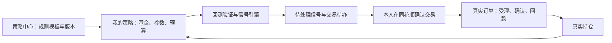

# 基金 AI 工作台：功能与接入调整

这次交付把原 HTML 的演示交互改成了可运行的本地工作台。真实持仓、钱包、订单与交易准备通过附件中的 thsfund SDK 查询。策略模板与个人配置分开保存；模型接入支持 ChatGPT / Codex 订阅和 API Key 两条路径。

原稿备份：`reference/fund-ai-workbench.original.html`。附件里的操作指引作为接口参考，没有当作本次用户要求买入、赎回或撤单的授权。

## 1. 原页面最值得调整的地方

| 原页面问题 | 用户会遇到的困惑 | 调整后的行为 |
|---|---|---|
| 策略中心卡片同时包含规则、基金、运行状态、预算和回测结果 | 不清楚是在选择一种方法，还是操作自己已经在运行的计划 | 策略中心只放规则模板；创建后进入我的策略 |
| 交易计划与策略运行信息重叠 | 不清楚计划、信号、订单分别代表什么 | 我的策略管理参数与预算；交易待办保存意图；真实订单反映账户事实 |
| 我的基金混合自选、手工台账与真实持仓 | 关注基金可能被误认为持有，手填记录可能被当作真实资产 | 自选独立；持仓只读取账户接口；本地计划单独保存 |
| 点击确认就提示生成待成交记录 | 用户可能误认为交易已经提交 | 保存后明确显示“未提交”；真实订单仅从接口读取 |
| 固定显示 R5、15:00、T+1 | 不同产品、客户风险、节假日、确认周期差异被掩盖 | 产品/客户风险、申请日、预计确认日等以接口返回为准 |
| 写死净值、收益曲线、相关性、波动率与持仓诊断 | 图表看起来可信，但没有证据来源 | 只计算当前快照能支持的持仓金额占比；历史指标留空并说明数据依赖 |
| 不同区间的回测业绩并排比较 | 容易把不可比的收益当成排名 | 当前移除虚构业绩；后续比较须统一区间、预算现金流、费用和基准 |
| Agent 开关决定是否能够取数 | 查看自己的账户也被绑在模型能力上 | 账户同步独立于 AI；对话可逐条选择是否附带真实持仓 |
| 接入 AI 只有 alert 提示 | 无法登录、配置、判断接入是否成功 | 增加真实连接状态、订阅入口、API 地址、协议、模型和密钥配置 |
| 缺少失败和部分成功状态 | 查询失败可能被误读成没有持仓 | 分别展示加载、空账户、授权失效、部分失败、上次快照与真实错误 |

## 2. 策略中心与我的策略的关系

模板回答“按什么规则”；策略实例回答“哪些基金、多少预算、什么参数”；信号回答“何时触发、为何触发”；订单回答“实际提交并确认了什么”；持仓回答“现在账户有什么”。

本次实现的策略实例固定保存模板版本、参数、月预算和单次金额，并支持归档。草稿不等于运行中，不虚构信号。已有持仓关联草稿仅用于研究，不能把关联前的收益归因给该策略。

同一基金当前只允许关联一份未归档策略，避免多个计划重复计算预算。后续如要支持同基金多策略，应以 thsfund 的真实分仓账户为归属基础，并建立订单—分仓—策略实例映射，不能只按基金代码分账。

## 3. 我的持仓应包含的功能

- **账户汇总**：基金总金额、持有收益、最新日收益、钱包总份额；显示来源与同步时间。
- **持仓明细**：基金名称/代码、金额、份额、收益及接口收益率、策略草稿关联；支持名称/代码筛选。
- **单基金管理**：具体账户、脱敏银行卡、可用份额、净值日期与收益日期；可进入买入准备、赎回准备、关联策略、自选与订单查询。
- **组合分析**：基于实际快照计算金额占比、最大单只占比、待确认份额基金数、收益为正/负的基金数、草稿关联比例。
- **钱包与账户**：总份额、可用、可取、冻结、转换冻结、收益、银行卡份额。预算和钱包各自独立，不合并成未经证实的“可用资金”。
- **订单中心**：日期、业务类型、处理中/历史订单筛选；游标分页；查看申请、确认、回款与当前可撤资格；支持多选、全选可撤订单并逐笔批量撤单。

暂不计算年化收益、夏普比率、最大回撤或基金相关性。这些需要完整历史净值、申赎和分红现金流，当前持仓快照不足以支持。

## 4. thsfund 的实际接口接入

| 页面功能 | CLI 接口 | 实现状态 |
|---|---|---|
| 持仓与钱包汇总 | `aijijin holding overview` | 已实测真实数据 |
| 具体交易账户、净值日期、可用份额 | `aijijin holding list --share-category 01…07` | 已实测真实数据，按类别独立查询 |
| 处理中/历史订单及分页 | `aijijin trade list` | 已实测真实数据，后续页携带上一页游标 |
| 订单详情与可撤资格 | `aijijin trade detail` | 已接入；失败、已撤和作废订单保留列表事实 |
| 买入准备 | `aijijin fund subscribe-init` + `fee-rule` | 已实测风险、起购金额、费率与日期 |
| 赎回准备 | `aijijin fund redeem-render` | 已实测；先由用户选择具体账户 |
| 失效后重新授权 | `aijijin auth login` | 页面可发起官方扫码流程；当前已有授权有效 |
| 买入、赎回、撤单提交 | 写接口 | 当前工作台未开放，正式操作在同花顺 App 完成 |

使用项目自己的 `.venv` 安装附件 SDK 0.2.3，不替换机器上原有的 0.2.2。所有基金请求均通过 CLI 发起；没有绕过 SDK 直连受保护接口，也没有读取或导出账户凭据。

实际联调发现并处理了以下差异：

1. 部分接口返回 `CLI.data → {status_code, data}`，比参考文档多一层业务信封。适配层校验业务结果后拆包，避免把查询失败当作空数据。
2. 赎回阶梯费率实际位于 `fundInfo.stepRates`。费率小数要转百分数，区间要保留上下界是否包含。
3. `maxRedemptionVol` 可能是产品规则上限，远大于账户可用份额。页面另外读取账户可用份额并限制计划值。
4. 文档中协议记录存在 `SELL` / `REDEEM` 不一致，SDK 0.2.3 schema 实际接受 `REDEEM`。未来接入提交链路前应统一文档并做专项验收。

## 5. 两种 AI 接入

**订阅计划**：当前实现 ChatGPT / Codex 订阅，检测本机 `codex login status`，通过官方 Codex CLI 发起隔离的文本推理。临时工作目录、只读沙箱，关闭 shell、插件、应用和多代理工具，不给模型基金交易能力。当前机器已检测到 ChatGPT 登录。

**API Key**：配置 HTTPS Base URL、模型 ID 和协议，支持 OpenAI Responses 与 OpenAI 兼容 Chat Completions。密钥只保留在本地服务内存；不写 localStorage、不回传前端、不进入源码或日志；更换服务地址时必须重新填写密钥。是否能调用取决于实际服务商权限、模型和额度。

订阅与 API 独立计费，不能用订阅登录代替通用 API Key。[OpenAI 官方认证说明](https://learn.chatgpt.com/docs/auth)支持这两种 Codex 接入方式；API 使用[Responses 接口](https://developers.openai.com/api/reference/resources/responses/methods/create)。

账户数据默认不附带到 AI 请求。用户本次勾选后，后端重新取得持仓快照并附加；钱包、银行卡与凭据不发送。最近对话作为上下文发送，页面提供清空对话按钮。

## 6. 后续开发优先级

| 优先级 | 工作 | 完成标准 |
|---|---|---|
| P0 | 策略数据与计算引擎 | 每份实例输出带日期、参数版本和证据的回测/信号；数据不足时阻断运行 |
| P0 | 完整交易确认链路 | 风险测评、账户资料、金额校验、支付账户/分仓、协议记录、最终确认依次完成；提交不明先查订单，禁止盲目重试 |
| P1 | 订单与策略归因 | 用真实订单号与分仓 ID 对账；正确处理撤单、部分确认、分红与转换 |
| P1 | 策略编辑与版本迁移 | 参数变更生成新版本，保留旧信号与交易引用 |
| P1 | 统一回测比较 | 同区间、同预算现金流、同费用和基准，同时展示投入、收益、回撤和资金占用 |
| P2 | 行情、自选与历史分析 | 从可靠行情源获取基金身份、净值和历史数据，附上数据截止日期 |
| P2 | 自动检查与通知 | 仅为已验证并启用的实例执行；处理交易日历、重复信号、冲突预算、失败恢复 |

## 7. 当前交付边界

本地工作台已能查询真实账户并保存个人配置。它不是已完整上线的交易终端。回测/信号引擎、实际买卖/撤单提交、策略收益归因仍需后续接入；页面对这些状态有明确说明。

验证包括真实账户接口联调、浏览器交互与响应式检查、15 项后端行为测试。实测持仓 12 只、处理中订单 4 笔、所选近 30 天历史订单 14 笔；这些是本次验证时的账户返回数量，不写死在产品中。策略创建后刷新页面仍能正确显示，专用测试策略已清理。

ChatGPT / Codex 订阅已通过实际文本推理验证，未附带持仓数据。当前环境一次请求约需 120 秒；为避免本机 HTTP 代理切断长请求，采用后台任务和页面查询进度的方式。API Key 模式因未提供真实密钥，只验证了配置与请求合同，不宣称已经通过用户账号的真实推理调用。
